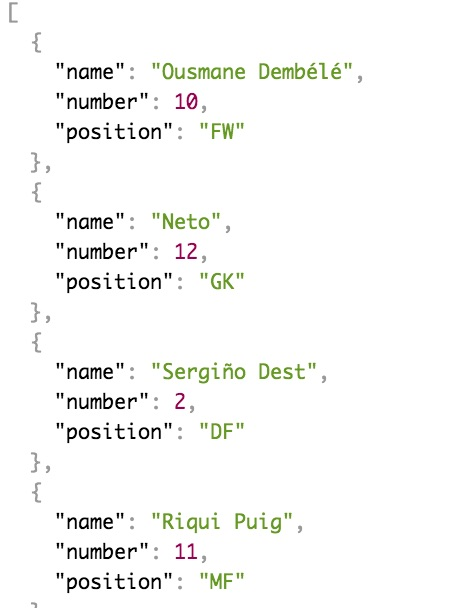
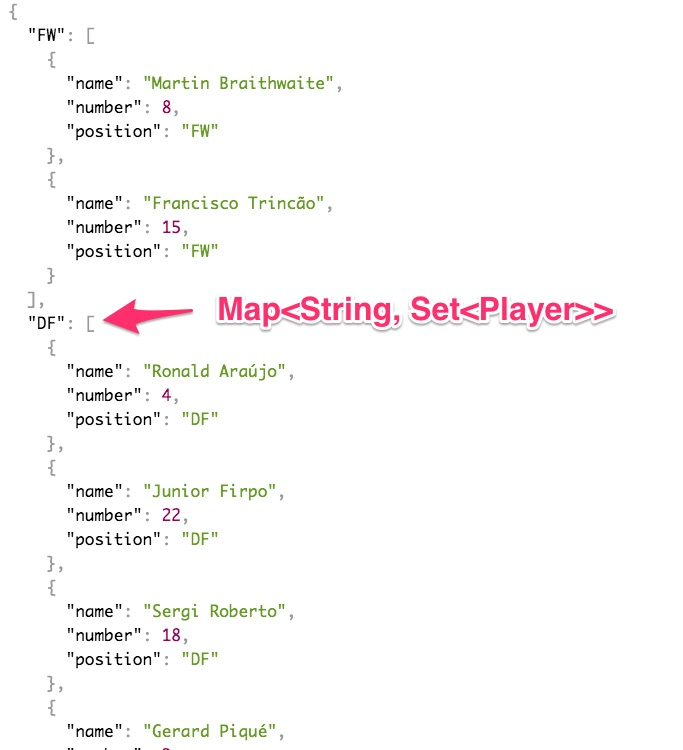

# Kiểm thử REST API với dự án Barcelona Team.


Lớp mình có 10 sinh viên. Buổi tới cả 10 bạn sẽ phải nộp bài. Để kiểm thử chi tiết mỗi dự án cần khoảng 15 phút. Như vậy tối thiểu mất 150 phút chỉ để kiểm tra bài chấm điểm. Tôi không thể làm công việc nhàm chán và kỳ cục như vậy.


Các bạn hãy lập trình đúng các REST API End Point như mô tả dưới đây. Tôi sẽ viết phần mềm để kiểm thử tự động. Giả thiết laptop của bạn ở địa chỉ 192.168.1.17. Ứng dụng Spring Boot lắng nghe ở cổng 8080. Các REST End Point sẽ có dạng ```http://192.168.1.17:8080/chooseteam```

## Tham khảo một số file code mẫu

1. [TeamException.java](samples/TeamException.java) Custom runtime exception
2. [APIError.java](samples/APIError.java) class đóng gói lỗi trả về qua REST
3. [APIException.java](samples/APIException.java) custome runtime exception sẽ hứng khi WebClient gọi lên REST API
4. [CustomExceptionHandler.java](samples/CustomExceptionHandler.java) chuyên để bắt ngoại lệ phát sinh ở REST Controller

## Yêu cầu API End Point

### 1. ```GET /team``` trả về danh sách 11 cầu thủ trong đội hình.
Không yêu cầu sắp xếp theo bất kỳ tiêu chí gì mà chỉ cần trả về đủ 11 cầu thủ.
Lần đầu gọi cần xếp đội hình mặc định ```442``` để trả về mà không cần gọi lệnh ```GET /chooseteam/xyz```




### 2. ```GET /teamgroup``` trả về danh sách 11 cầu thủ phân theo vị trí
Cần chia ra 4 nhóm vị trí: "GK", "DF", "MF", "FW".


Xem ví dụ [team.json](team.json)


### 3. ```GET /chooseteam/{x}{y}{z}``` dựng team theo chiến thuật
xyz là tham số mô tả:
- x: số lượng DF
- y: số lượng MF
- z: số lượng FW

Trả về lỗi 400 (BadRequest) trong những trường hợp sau đây. Chú ý phải trả về đúng từng ký tự theo yêu cầu thiết kế thì phần mềm mới tự động kiểm tra được.

1. x không phải chữ số, hoặc bằng 0. Làm tương tự với y, z
  ```json
  {
    "message" : "TeamException : Invalid number format in team pattern",
    "detail": ["For input string: x"]
  }
  ```
  hãy ghi rõ giá trị của ```x``` trong trường detail.

2. Tổng x + y + z không bằng 10
  ```json
  {
    "message" : "TeamException : Total number of players is not 11",
    "detail": "x + y + z must be 10"
  }
  ```
3. Không thể đủ cầu thủ để sắp xếp đội hình. Ví dụ ```xyz = 118```. Không thể kiếm đủ 8 tiền đạo
  ```json
  {
    "message" : "TeamException : Request players more than available",
    "detail": "Requested: 8, available: 6"
  }
  ```

### 4. ```GET /subtitute/{playerno}{position}``` thay cầu thủ đang đá trên sân bằng một vị trí khác

- ```{playerno}```: số áo cầu thủ
- ```{position}```: loại vị trí cầu thủ mới sẽ thay vào

1. ```{playerno}``` sai định dạng, không phải là số. Báo lỗi kiểm tra parameter
  ```json
  {
    "message" : "Argument type mismatch"
  }
  ```

2. Không có cầu thủ nào đang đó có số áo như ```{playerno}```
  ```json
  {
    "message" : "TeamException : No current player with that number",
    "detail": "{playerno}"
  }
  ```
3. ```{position}``` không nằm trong nhóm {GK, DF, MF, FW}. Báo lỗi kiểm tra parameter
  ```json
  {
    "message" : "Argument type mismatch",
  }
  ```
4. Không còn cầu thủ thay thế cho vị trí yêu cầu
  ```json
  {
    "message" : "TeamException : No player is available for this position",
    "detail": "[{position}]"
  }
  ```
5. Quá 5 lượt thay cầu thủ
  ```json
  {
    "message" : "TeamException : Number of substitutions has reached 5",
  }
  ```


  
