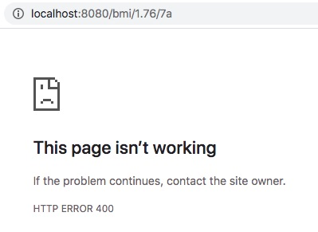
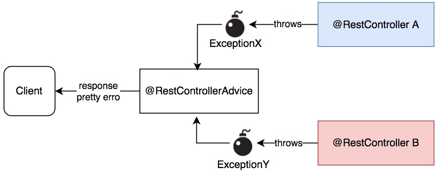

# Bắt ngoại lệ và trả về lỗi trong REST API - Kiểm thử REST API

Đây là bài hướng dẫn sẽ rất dài và phức tạp. Vậy bình tĩnh đọc, thực hành. Mọi thứ sẽ ổn.


## 1. Bắt ngoại lệ và trả về lỗi trong REST API.

## 1.1 Khác biệt giữa Ngoại lệ (Exception) và Mã lỗi (Error code) là gì?

 Exception phát sinh từ một dòng lệnh trong phương thức trên đỉnh của call stack. Nếu phương thức đó có try catch thì tự xử lý hoặc tiếp tục ném ra Exception cho phương thức ngoài. Phương thúc ngoài không xử lý thì Exception tiếp tục ném ra.

 Error code dùng khi giữa bên gọi (caller) và bên bị gọi (callee) không có liên quan nhau trong calling stack (ngăn xếp lời gọi). Nó phù hợp với kiểu yêu cầu (request) và trả lời (response) kiểu như gọi REST API.


## 1.2 Trả về thông báo lỗi đẹp từ REST API
Báo lỗi xấu, nhìn rất khó chịu



Còn đây là báo lỗi đẹp, thân thiện với người dùng hoặc lập trình viên client.


Một ví dụ báo lỗi dễ hiểu, thân thiện giúp dev xử lý lỗi tốt hơn


Xem [CustomExceptionHandler.java](src/main/java/com/onemount/barcelonateam/controller/CustomExceptionHandler.java)

Để làm được việc này, cần tạo ra một class kế thừa ```ResponseEntityExceptionHandler``` và được đánh dấu bởi annotation ```@RestControllerAdvice```
```java
@RestControllerAdvice  //Bổ trợ cho @RestController thực chất là bắt các Exception
public class CustomExceptionHandler extends ResponseEntityExceptionHandler {
}
```



### Hàm này hứng ngoại lệ chung nhất
 Sau khi các ngoại lệ chi tiết bỏ qua không bắt. Bạn có thấy nó bắt ```value = {Exception.class, RuntimeException.class}``` là 2 base Exception class.

```java
@ExceptionHandler(value = {Exception.class, RuntimeException.class})
public final ResponseEntity<APIError> handleAllExceptions(Exception ex, WebRequest request) {
  APIError apiError = new APIError("Generic Exception", ex.getLocalizedMessage(), ex.getCause().getMessage());
  return new ResponseEntity<>(apiError, HttpStatus.INTERNAL_SERVER_ERROR);
}
```

### Hàm hứng ngoại lệ có kiểu cụ thể như ```TeamException.class```
```json
{
  "message": "TeamException : No player is available for this position",
  "details": [
    "GK"
  ]
}
```

```java
@ExceptionHandler(TeamException.class)
public final ResponseEntity<APIError> handleUserNotFoundException(TeamException ex, WebRequest request) {
  APIError apiError = new APIError(ex);
  return new ResponseEntity<>(apiError, HttpStatus.BAD_REQUEST);
}
```


Đặc điểm các hàm này trả về ```ResponseEntity<APIError>```. Trong đó [APIError](src/main/java/com/onemount/barcelonateam/exceptions/APIError.java) là class chứa các thông tin mô tả lỗi

### Hàm báo lỗi khi tham số truyền vào sai định dạng ```TypeMismatchException ex```

```json
{
  "message": "Argument type mismatch",
  "details": [
    "Failed to convert value of type 'java.lang.String' to required type 'com.onemount.barcelonateam.model.Position'"
  ]
}
```

```java
@Override
protected ResponseEntity<Object> handleTypeMismatch(TypeMismatchException ex, HttpHeaders headers, HttpStatus status,
    WebRequest request) {
  APIError apiError = new APIError("Argument type mismatch", ex.getLocalizedMessage());
  return new ResponseEntity<>(apiError, HttpStatus.BAD_REQUEST);
}
```


### Hàm báo lỗi khi sai đường dẫn ```NoHandlerFoundException```

```json
{
  "message": "No handler found",
  "details": [
    "No handler found for GET /subwtitute/1/GKe"
  ]
}
```
```java
@Override
protected ResponseEntity<Object> handleNoHandlerFoundException(NoHandlerFoundException ex, HttpHeaders headers,
    HttpStatus status, WebRequest request) {

  APIError apiError = new APIError("No handler found", ex.getLocalizedMessage());
  return new ResponseEntity<>(apiError, HttpStatus.BAD_REQUEST);
}
```

## 2. Kiểm thử REST API
Phần này mình để ra [Unit Test REST API](UnitTestRest.md) riêng vì nó khá dài.