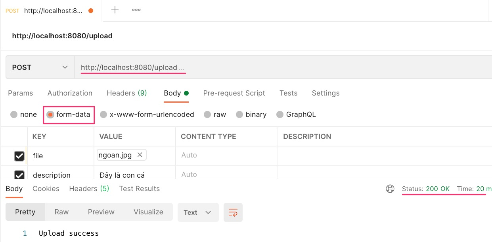

# Hướng dẫn Upload binary file lên REST

## 1. Cấu hình pom.xml
Chỉ cần spring-boot-starter-web là đủ. Ngoài ra lombok và spring-boot-starter-log4j2 để logging.

```xml
<dependency>
  <groupId>org.springframework.boot</groupId>
  <artifactId>spring-boot-starter-web</artifactId>
  <exclusions>
    <exclusion>
      <groupId>org.springframework.boot</groupId>
      <artifactId>spring-boot-starter-logging</artifactId>
    </exclusion>
  </exclusions>
</dependency>
<dependency>
  <groupId>org.springframework.boot</groupId>
  <artifactId>spring-boot-starter-log4j2</artifactId>
</dependency>
<dependency>
  <groupId>org.projectlombok</groupId>
  <artifactId>lombok</artifactId>
  <optional>true</optional>
</dependency>
```

## 2. Cấu trúc thư mục
```
.
├── logs <-- Thư mục log
│   ├── app.log
│   └── springboot.log
├── src
│   ├── main
│   │   ├── java
│   │   │   └── vn
│   │   │       └── techmaster
│   │   │           └── simpleupload
│   │   │               ├── controller
│   │   │               │   ├── APIError.java <-- Class để đóng gói ngoại lệ trả về kiểu JSON
│   │   │               │   ├── CustomExceptionHandler.java <-- Xử lý các ngoại lệ
│   │   │               │   └── UploadController.java <-- REST Controller xử lý post
│   │   │               ├── exception
│   │   │               │   └── RESTException.java
│   │   │               └── SimpleuploadApplication.java
│   │   └── resources
│   │       ├── application.properties <-- cấu hình ứng dụng SpringBoot
│   │       └── log4j2.xml <-- Cấu hình log4j2
├── pom.xml
```
## 3. Cấu hình trong application.properties
Cấu hình để SpringBoot hỗ trợ upload file đến 10 Mb.
```
spring.http.multipart.max-file-size=10MB
spring.http.multipart.max-request-size=10MB
spring.mvc.throw-exception-if-no-handler-found=true
spring.resources.add-mappings=false
```
## 4. Tạo phương thức POST hỗ trợ paramter dạng multipart
Chú ý 2 tham số mà phương thức POST sẽ nhận
```java
@RequestParam("file") MultipartFile file, //Nhận file binary có tên là "file"
@RequestParam("description") String description //Nhận trường text có tên là "description"
```
```java
@RestController
@Slf4j
public class UploadController {
  @PostMapping("/upload")
  public ResponseEntity<String> upload(
    @RequestParam("file") MultipartFile file,
    @RequestParam("description") String description) {
    if (file == null) {
			throw new RESTException("You must select the a file for uploading", HttpStatus.BAD_REQUEST);
		}

		InputStream inputStream;
    try {
      inputStream = file.getInputStream();
    } catch (IOException e) {
      log.error("Error when file.getInputStream", e.getMessage());
      throw new RESTException("Error at file.getInputStream", e);
    }
		String originalName = file.getOriginalFilename();
		String name = file.getName();
		String contentType = file.getContentType();
		long size = file.getSize();

		log.info("inputStream: " + inputStream);
		log.info("originalName: " + originalName);
		log.info("name: " + name);
		log.info("contentType: " + contentType);
		log.info("size: " + size);
    log.info("description: " + description);
    return ResponseEntity.ok().body("Upload success");
  }  
}
```

## 5. Upload thử bằng Postman


## 6. Xem log file
Vào [app.log](logs/app.log), bạn sẽ thấy
```
[INFO ] 2021-04-26 14:45:50.443 [http-nio-8080-exec-4] UploadController - inputStream: java.io.FileInputStream@5d168fc5
[INFO ] 2021-04-26 14:45:50.443 [http-nio-8080-exec-4] UploadController - originalName: ngoan.jpg
[INFO ] 2021-04-26 14:45:50.444 [http-nio-8080-exec-4] UploadController - name: file
[INFO ] 2021-04-26 14:45:50.444 [http-nio-8080-exec-4] UploadController - contentType: image/jpeg
[INFO ] 2021-04-26 14:45:50.444 [http-nio-8080-exec-4] UploadController - size: 14204
[INFO ] 2021-04-26 14:45:50.445 [http-nio-8080-exec-4] UploadController - description: Đây là con cá
```

Thử đổi tên trường "description" thành một tên mới, lỗi sẽ phát, log ghi nhận là
```
[ERROR] 2021-04-26 14:45:21.284 [http-nio-8080-exec-1] CustomExceptionHandler - MissingServletRequestParameterException : Required request parameter 'description' for method parameter type String is not present
```