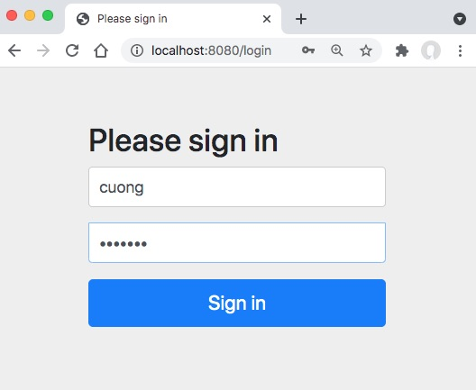
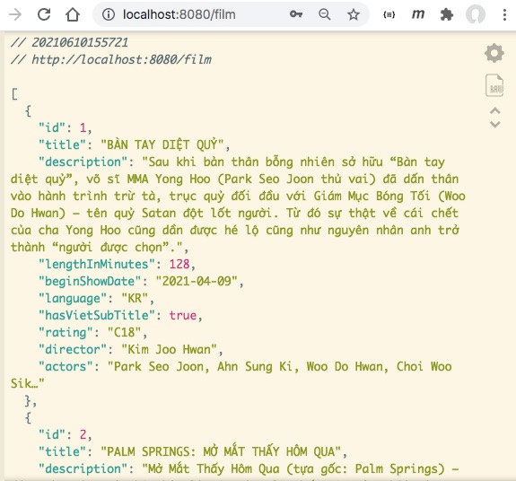

# Hướng dẫn thực hành JWT

## 0. Giới thiệu dự án
Đây là đầu tiên của loạt bài hướng dẫn cấu hình JWT cho một dự án REST API.
Dự án này chỉ có duy nhất một danh sách film. Có những role sau đây:
- Anonymous user được xem danh sách film tóm tắt gồm tiêu đề.
- Login user được xem danh sách film và thông tin chi tiết từng film.
- Admin user được tạo thêm film (để đơn giản, tôi không sửa, xoá film)

Trong bài này tôi hoàn toàn chưa cấu hình Spring Security mà chỉ sử dụng cấu hình mặc định.

## 1. Cấu hình căn bản

Trong [pom.xml](pom.xml) cần có:
- spring-boot-starter-data-jpa
- spring-boot-starter-security
- spring-boot-starter-web
- h2
- lombok

Cấu hình kết nối h2 trong [application.properties](src/main/resources/application.properties)
```
spring.datasource.url=jdbc:h2:mem:test
spring.datasource.driverClassName=org.h2.Driver
spring.datasource.username=sa
spring.datasource.password=123
spring.jpa.database-platform=org.hibernate.dialect.H2Dialect
spring.h2.console.enabled=true
server.error.whitelabel.enabled=false
```

Cấu hình user/pass trong [application.properties](src/main/resources/application.properties)
```
spring.security.user.name=cuong
spring.security.user.password=pass123
```

## 2. Xây dựng model Film, FilmController, FilmService, FilmRepository

- Model [Film.java](src/main/java/vn/techmaster/vincinema/model/Film.java)
- REST Controller [FilmController.java](src/main/java/vn/techmaster/vincinema/controller/FilmController.java)
- Service [FilmService.java](src/main/java/vn/techmaster/vincinema/service/FilmService.java)
- Repository [FilmRepository.java](src/main/java/vn/techmaster/vincinema/repository/FilmRepository.java)

Chạy ứng dụng rồi truy cập vào http://localhost:8080/film, bạn sẽ thấy màn hình login hiện ra. sau khi bạn gõ username/pass = cuong/pass123 thì sẽ xem được dữ liệu REST ở

http://localhost:8080/film



