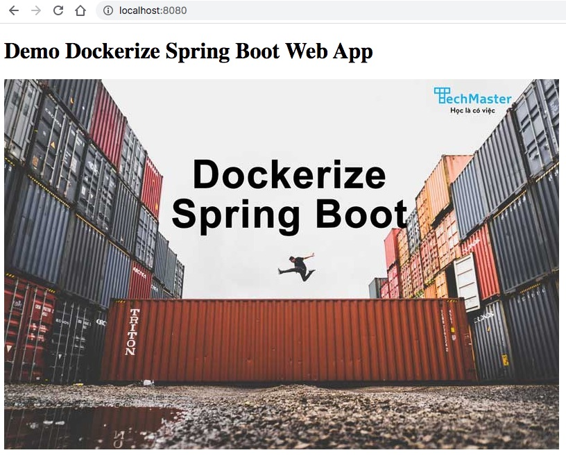

# Đóng gói ứng dụng Spring Boot bằng Dockerfile

## Các bước chính
1. Biên dịch ra file *.jar.
2. Viết Dockerfile để đóng gói *.jar vào docker image.
3. Viết file Makefile để tự động hoá tác vụ số 1 và 2.
4. Chọn base Docker image file nào để tiết kiệm kích thước file size.


## 1. Biên dịch ra file *.jar
Đóng gói ra file *.jar, kết quả sẽ xuất ra một file *.jar trong thư mục target
```
$ ./mvnw package
```
Kết quả file ```plaindocker-1.0.jar``` được tạo ra trong thư mục [target](target)

tên file jar được ghép từ 2 thuộc tính trong file [pom.xml](pom.xml)
```xml
<artifactId>plaindocker</artifactId>
<version>1.0</version>
```

Chạy thử file ```plaindocker-1.0.jar``` bằng lệnh
```
$ java -jar ./target/plaindocker-1.0.jar
```

Mở trình biên dịch sau đó truy cập địa chỉ http://localhost:8080 sẽ thấy



Giải thích cấu trúc thư mục
```
.
├── src
│   ├── main
│   │   ├── java
│   │   │   ├── vn
│   │   │   │   ├── techmaster
│   │   │   │   │   ├── plaindocker
│   │   │   │   │   │   ├── controller
│   │   │   │   │   │   │   └── HomeController.java <-- Xử lý các request
│   │   │   │   │   │   └── PlaindockerApplication.java <-- chứa hàm main
│   │   ├── resources
│   │   │   ├── static <-- Chứa các file static
│   │   │   │   └── images
│   │   │   │       └── dockerize.jpg <-- file ảnh tĩnh sẽ phải đóng gói
│   │   │   ├── templates
│   │   │   │   └── index.html <-- file thymeleaf view template
│   │   │   └── application.properties
├── target  <-- Thư mục chưa kết quả biên dịch
│   ├── classes
│   │   ├── static
│   │   │   └── images
│   │   │       └── dockerize.jpg
│   │   ├── templates
│   │   │   └── index.html
│   │   ├── vn
│   │   │   ├── techmaster
│   │   │   │   ├── plaindocker
│   │   │   │   │   ├── controller
│   │   │   │   │   │   └── HomeController.class  <-- class biên dịch từ HomeController.java
│   │   │   │   │   └── PlaindockerApplication.class <-- class biên dịch từ PlaindockerApplication.java
│   │   └── application.properties
│   ├── plaindocker-1.0.jar <-- file *.jar sau khi chạy lệnh ./mvnw package
│   └── plaindocker-1.0.jar.original
```

##  

Trong thư mục, di chuyển vào thư mục gốc dự án gõ:

```
docker build -t plaindocker:latest .
```
nội dung [Dockerfile](Dockerfile) như sau:
```Dockerfile
# Sử dụng base image hệ điều hành alpine để tiết kiệm dung lượng
FROM openjdk:17-alpine

# Tạo group spring và user spring
RUN addgroup -S spring && adduser -S spring -G spring

# Dùng user spring để khởi động ứng dụng Spring Boot sẽ an toàn hơn
USER spring:spring

# Đặt biến JAR_FILE là file có đuôi jar trong thư mục target
ARG JAR_FILE=target/*.jar

# Copy JAR_FILE vào docker image với tên file mới là app.jar
COPY ${JAR_FILE} app.jar
ENTRYPOINT ["java","-jar","/app.jar"]
```

Chạy thử với Docker image vừa tạo ra:

```
$ docker images plaindocker
REPOSITORY          TAG                 IMAGE ID            CREATED             SIZE
plaindocker         latest              a2df5bb62971        11 minutes ago      344MB

$ docker run -p 7000:8080 -d --name plaindocker plaindocker:latest
```

Giải thích các tham số lệnh ```docker run``` một
- ```-p 7000:8080```: nối từ cổng 7000 ở host vào cổng 8080 của container
- ```-d```: chạy ở chế độ daemon (ngầm, không tương tác, xuất thông tin ra terminal)
- ```--name plaindocker```: đặt tên gợi nhớ cho container
- ```plaindocker:latest```: tên của docker image vừa tạo ra

## 3. Viết file Makefile để tự động hoá tác vụ số 1 và 2.
Để đơn giản hoá việc gõ lệnh thủ công, chúng ta tạo một [Makefile](Makefile)

```Makefile
containername = plaindocker
build:
	./mvnw package
	docker build -t plaindocker:latest .
start:
	docker rm $(containername)
	docker run -p 7000:8080 -d --name $(containername) plaindocker:latest
stop:
	docker stop $(containername)
```

- ```make build``` để tạo Docker image mới
- ```make start``` để khởi động Docker container
- ```make stop``` để dừng Docker container

## 4. Chọn base Docker image file nào để tiết kiệm kích thước file size?