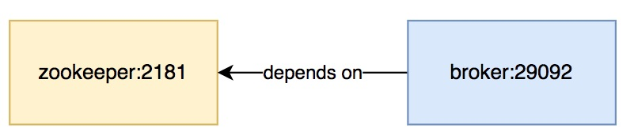
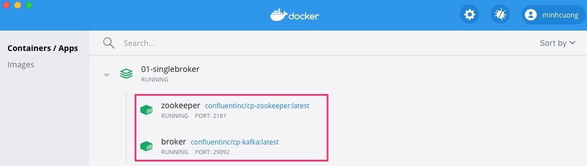
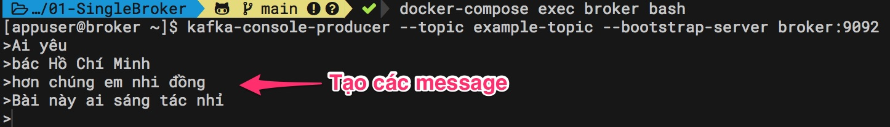
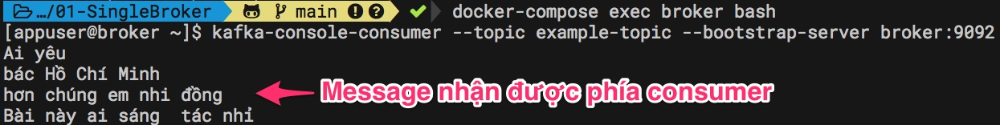
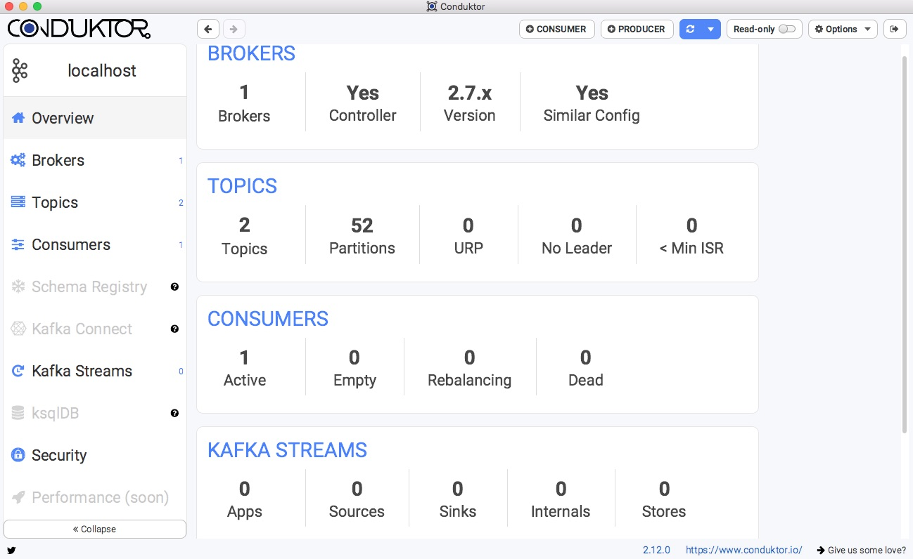
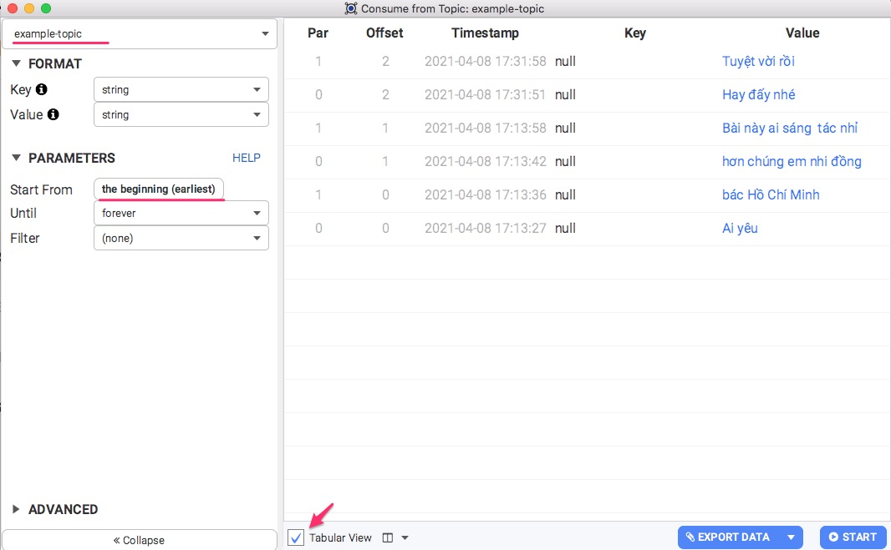

# Single Broker

## 1. Tạo docker container

Trong bài thực hành này, chúng ta chỉ sử dụng cấu hình tối thiểu gồm một zookeeper và một broker. Chú ý khi gõ trong terminal, các bạn chỉ gõ những lệnh bắt đầu bằng ký tự nhắc $ và không gõ ký tự $. Các lệnh không có nhắc $ là kết quả terminal trả về, mình ghi lại để các bạn dễ hình dung.



Để khởi động 2 container tôi sẽ dùng file [docker-compose.yml](docker-compose.yml) bắt chiếc theo [Console Producer and Consumer Basics, no (de)serializers](https://kafka-tutorials.confluent.io/kafka-console-consumer-producer-basics/kafka.html)

```yaml
version: '2'

services:
  zookeeper:
    image: confluentinc/cp-zookeeper:latest
    hostname: zookeeper
    container_name: zookeeper
    ports:
      - "2181:2181"
    environment:
      ZOOKEEPER_CLIENT_PORT: 2181
      ZOOKEEPER_TICK_TIME: 2000

  broker:
    image: confluentinc/cp-kafka:latest
    hostname: broker
    container_name: broker
    depends_on:
      - zookeeper
    ports:
      - "29092:29092"
    environment:
      KAFKA_BROKER_ID: 1
      KAFKA_ZOOKEEPER_CONNECT: 'zookeeper:2181'
      KAFKA_LISTENER_SECURITY_PROTOCOL_MAP: PLAINTEXT:PLAINTEXT,PLAINTEXT_HOST:PLAINTEXT
      KAFKA_ADVERTISED_LISTENERS: PLAINTEXT://broker:9092,PLAINTEXT_HOST://localhost:29092
      KAFKA_OFFSETS_TOPIC_REPLICATION_FACTOR: 1
      KAFKA_GROUP_INITIAL_REBALANCE_DELAY_MS: 0
  
```

1. Khởi động docker-compose bằng lệnh
```
docker-compose up -d
```

2. Kiểm tra xem container nào đang hoạt động
```
docker ps -a --format '{{.Names}}'
```

Kết quả sẽ như sau:
```
broker
zookeeper
```
Hoặc mở Docker Dashboard ra xem:



## 2. Tạo một topic

```
$ docker-compose exec broker kafka-topics --create --topic example-topic --bootstrap-server broker:9092 --replication-factor 1 --partitions 2
Created topic example-topic.
```

## 3. Khởi động một console consumer lắng nghe sự kiện
Đầu tiên từ terminal khởi động bash shell ở container broker, là ứng dụng cho phép thao tác lệnh tiếp theo
```
$ docker-compose exec broker bash
[appuser@broker ~]$
```

Tiếp đến chạy Kafka consumer (chú ý bỏ qua đoạn nhắc lệnh ```[appuser@broker ~]$```)
```
[appuser@broker ~]$ kafka-console-consumer --topic example-topic --bootstrap-server broker:9092
```

## 4. Khởi động một console mới cho producer tạo ra sự kiện
Tạo thêm một cửa sổ terminal mới, rồi khởi động bash shell ở container broker. Chú ý khi mở xong terminal thì phải chuyển đến thư mục chứa file docker-compose.yml. Nếu không chuyển đến, sẽ không thể thực hiện được lệnh.
```
$ docker-compose exec broker bash
[appuser@broker ~]$
```

Tạo Kafka Producer, chú ý chỉ gõ lệnh từ dấu nhắc $ trở về bên phải
```
[appuser@broker ~]$ kafka-console-producer --topic example-topic --bootstrap-server broker:9092
>
```

Bắt đầu gõ text để tạo ra các message kiểu ```example-topic```
```
>Ai yêu
>bác Hồ Chí Minh
>hơn chúng em nhi đồng
>Bài này ai sáng tác nhỉ
```



## 5. Chuyển sang terminal Consumer xem có nhận được dữ liệu không

```
[appuser@broker ~]$ kafka-console-consumer --topic example-topic --bootstrap-server broker:9092
Ai yêu
bác Hồ Chí Minh
hơn chúng em nhi đồng
Bài này ai sáng  tác nhỉ
```

## 6. Sử dụng công cụ Conduktor có giao diện để quản lý Kafka
Nếu việc gõ terminal khiến bạn không thoải mái, bạn có thể tải [Conduktor](https://www.conduktor.io/) để kết nối vào broker gửi, nhận message trực quan. Conduktor miễn phí cho single cluster.



Tạo Cosumer để lắng nghe


## 7. Thử dùng Golang tạo Consumer Client.

Golang đơn giản hơn Spring Boot, nên mình tạo một ứng dụng Golang [consumer/main.go](consumer/main.go) để các bạn dễ hình dung:

```go
package main

import (
	"fmt"

	"gopkg.in/confluentinc/confluent-kafka-go.v1/kafka"
)

func main() {

	c, err := kafka.NewConsumer(&kafka.ConfigMap{
		"bootstrap.servers": "localhost:29092",
		"group.id":          "myGroup",
		"auto.offset.reset": "earliest",
	})

	if err != nil {
		panic(err)
	}

	c.SubscribeTopics([]string{"example-topic"}, nil)

	for {
		msg, err := c.ReadMessage(-1)
		if err == nil {
			fmt.Printf("Message on %s: %s\n", msg.TopicPartition, string(msg.Value))
		} else {
			// The client will automatically try to recover from all errors.
			fmt.Printf("Consumer error: %v (%v)\n", err, msg)
		}
	}

	c.Close()
}
```

Chuyển vào vào thư mục consumer, rồi gõ
```
$ go build
$ ./consumer
```

Thử tạo một số message có topic là ```example_topic``` từ producer, bạn sẽ thấy consumer hiện lên